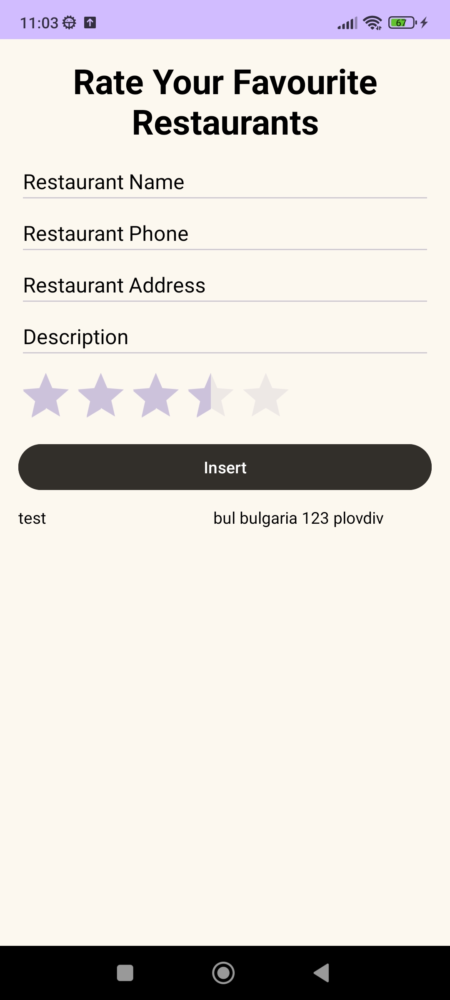
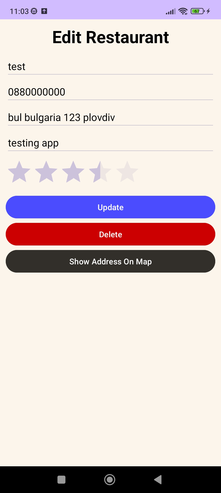
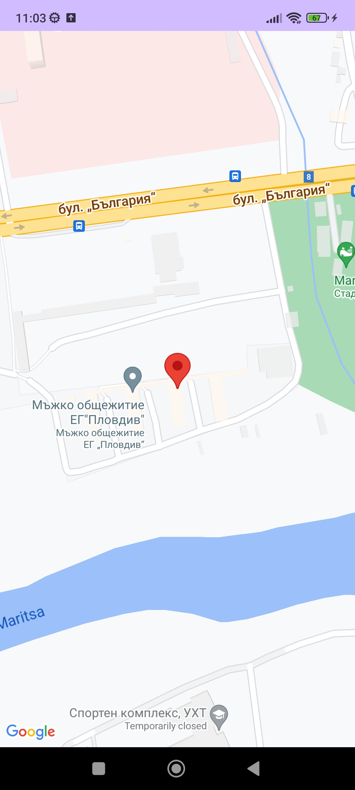

# Description:

The course project is a mobile application through which the user of the system can view and manage their rated restaurants, as well as access and read each review in real-time. Each user of the application has a list of their favorite restaurants. They can modify the review of a given restaurant or delete it from the list and see restaurants locations.

## Technologies used:
    Android Studio
    SQLite
    JAVA
    XML 
    Maps SDK for Android
    
### Features
###### Main page

###### Update and Delete page

###### Location page
