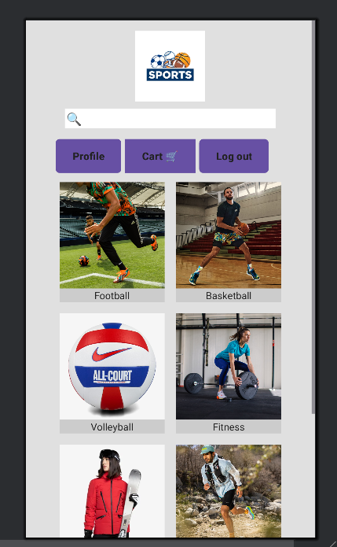
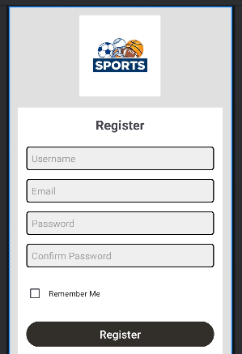
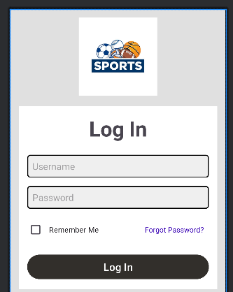
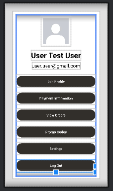
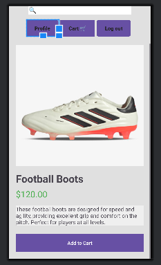

# Description:

The software project aims to demonstrate skills in designing a mobile application. In this case, the application showcases a design for an online sports goods store. This project aims to highlight only a user-friendly graphical user interface. It contains 5 layouts, which are presented below.

## Technologies used:
    Android Studio
    XML 
    
### Features
###### Main page

###### Register page

###### Login page

###### Profile page

###### Product page
