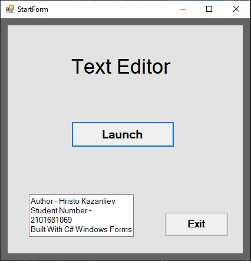
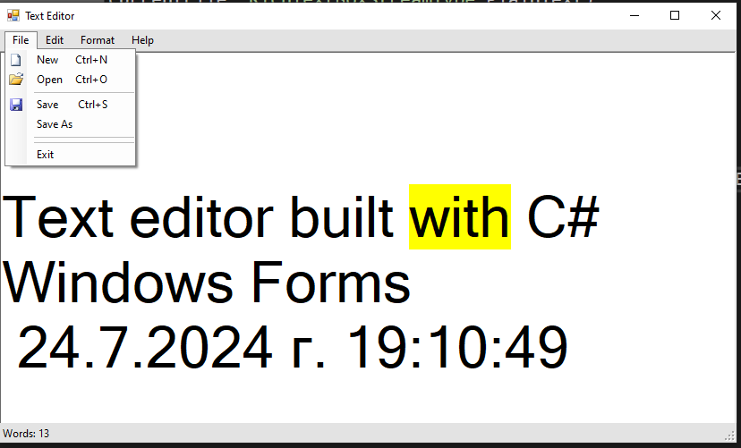
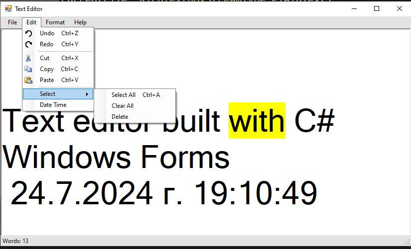

# Text Editor - Windows Forms

## Description:

This application is a text editor written in C# and Windows Forms with functionality similar to notepad.
    
    - The first menu strip includes options for creating a new file, opening an existing file, saving, and saving as.
    - The second menu strip includes options for undo, redo, cut, copy, paste, select all, and adding the current date and time.
    - The third menu strip includes font and color dialog options for changing the font, font style, font size, and colors.
    - The fourth menu strip includes search and replace functions for the rich text box.

## Technologies used:
    C# Windows Forms
    
### Features
###### Start-form

###### File-Functions

###### Edit-Functions
